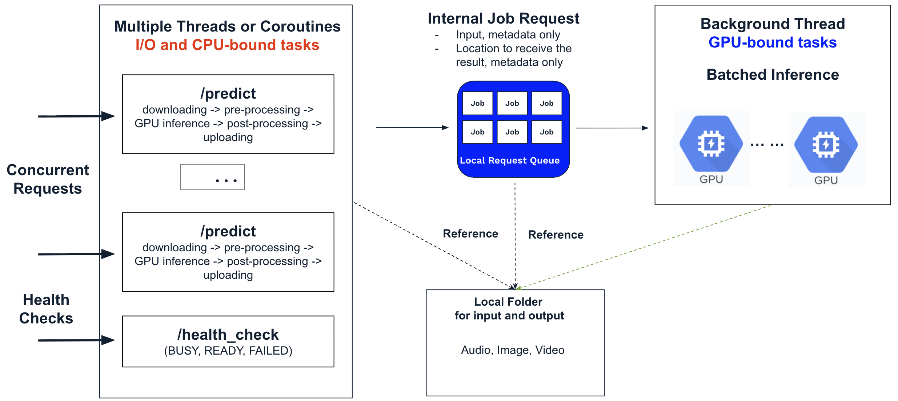
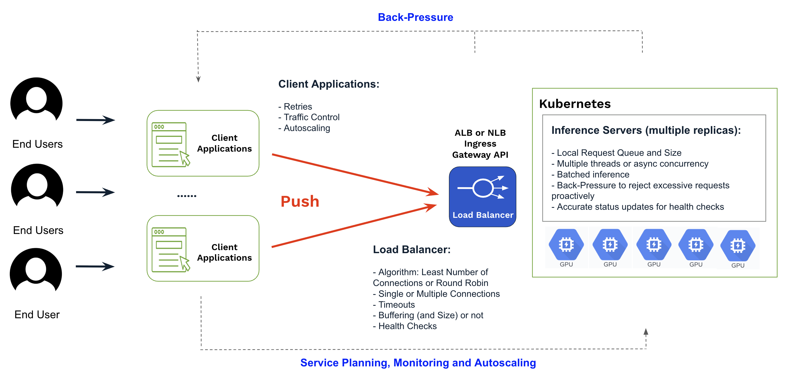

# Load Balancer for AI Inference

Running AI inference workloads—such as transcription, image and video generation, or LLMs—behind a load balancer (LB) is straightforward. Start by selecting an inference server (open-source or custom) to host your models, deploy multiple replicas as GPU-powered VMs or containers behind the load balancer (e.g., ALB, NLB, Kubernetes Ingress, or Gateway API), and secure the endpoint with a managed service like Cloudflare. Once configured, client applications or end users can send requests to the load balancer and receive results.

This approach can work well initially, but as user demand and traffic grow, issues may arise quickly if the inference server, load balancer, or client applications are not carefully built and configured.

## Common Issues When Using a Load Balancer

When client applications send bursts of requests to inference servers via the load balancer—assuming an image generation use case where each inference takes several to tens of seconds—the following issues may occur:

- **Request Overload and Timeouts:** If incoming requests exceed the capacity of the inference servers, they may queue at the load balancer or the servers, potentially causing timeout errors across the system. Many load balancers, including [Cloudflare](https://community.cloudflare.com/t/increase-cloudflare-max-request-duration/482873), have a maximum timeout of `100` seconds, and client applications may also have varying timeout settings.

- **Health Check Failures:** Some inference server implementations use a single thread for both inference and health checks. When the server is busy with inference, it may fail to respond to health checks within the expected interval. Platforms like Kubernetes or cloud providers may interpret this as a failure, potentially restarting or terminating the server. Conversely, some inference servers always report healthy regardless of their actual state, potentially causing many application-level errors when problems arise.

- **Suboptimal GPU Utilization:** Some inference servers simply rely on multiprocessing or multithreading for concurrent inference on a single GPU. This can limit optimal GPU cache utilization and negatively impact overall performance.

- **Lack of Back-Pressure and Flow Control:** Some client applications or inference servers do not implement back-pressure and flow control. Requests can pile up at the load balancer or inference servers, consuming system resources unnecessarily and potentially being dropped later instead of being rejected early by the client.

**Notes:** In practice, many custom inference servers are built using FastAPI, which supports asynchronous request handling. However, GPU inference—typically performed with frameworks like TensorFlow or PyTorch—often involves blocking operations that can stall FastAPI’s main thread and event loop, leading to various issues.

## Reference Implementation of Inference Servers 

To handle AI inference efficiently, inference servers should be designed with the following capabilities:

- **Local Request Queue:** Buffer incoming requests to handle traffic bursts efficiently.

- **Back-Pressure Mechanism:** Reject new requests when the queue is full to prevent system overload.

- **Dynamic Batching:** Group incoming requests dynamically to optimize GPU utilization and throughput.

- **Concurrent Handling:** Accept new requests and respond to health checks while processing GPU inference, providing accurate status updates to health probes such as READY, BUSY, FAILED, or other relevant states.

- **Task Seperation:** Split I/O, CPU, and GPU workloads to optimize resource utilization and improve overall performance and throughput.

Many open-source inference servers for LLMs, such as [vLLM](https://github.com/vllm-project/vllm) and [Hugging Face TGI](https://huggingface.co/docs/text-generation-inference/en/index), already implement these features. 

Some open-source inference servers, like [ComfyUI](https://github.com/comfyanonymous/ComfyUI) for image and video generation, are implemented as stateful, single-instance applications, allowing users to submit jobs asynchronously and later track progress or retrieve results. To deploy these inference servers at scale—such as multiple replicas behind a load balancer—each instance requires a locally running API converter to transform synchronous, stateless end-user requests into asynchronous calls to the server.

For general use cases, a well-designed custom inference server that incorporates these capabilities can reliably handle high traffic while minimizing resource waste and improving overall performance. The [example code](https://github.com/SaladTechnologies/mds/tree/main/inference-server) demonstrates how to implement this approach using Python (Flask/FastAPI) and TypeScript (Express).

## Optimized Solution Architecture and Configuration 

In addition to selecting a robust inference server, it is essential to optimize the end-to-end solution architecture and configuration to ensure high performance and reliability.

A load balancer typically provides options for controlling how requests are forwarded to inference servers, including routing algorithms, concurrency, timeouts, and health checks. These settings should be carefully chosen and aligned with the capabilities of the inference servers.

- **Algorithms**: Processing time for AI inference can vary significantly depending on factors such as size and duration of image or video, context length, audio length or the number of simiulations steps. In most cases, the Least Number of Connections algorithm effectively handles these variations and is recommended for optimal performance.

- **Concurrency:** Multiple connections to each backend server should generally be enabled to improve throughput—unless the inference server only supports single-threaded execution. In that case, buffering can be enabled at the load balancer to handle occasional traffic spikes.

- **Timeouts:** Timeout settings across the system—including the load balancer, client applications, and services like Cloudflare—should be carefully considered. Buffer sizes on the load balancer and inference servers must be chosen to align with these timeout configurations.

Client applications also have key requirements:

- **Traffic Control:** Reject new requests when the load balancer or inference server is at capacity.

- **Retry Mechanisms:** Handle occasional packet loss or failed requests gracefully.

- **Autoscaling:** Dynamically adjust the number of inference server replicas based on application-level metrics. 

**Notes:** Inference servers typically have long startup times—due to pulling container images, downloading models, and performing warm-up—which can take tens of minutes. Real-time autoscaling to match GPU resources to AI system load on a minute-by-minute basis is generally impractical. Therefore, careful service planning and continuous monitoring are essential.

## Application Constraints and Alternative Solutions

Given common maximum timeout limits and the need for a good user experience, the solution architecture described above is best suited for real-time inference workloads and synchronous requests that complete in under `100 seconds`. Typical examples include image generation, short audio transcription, and streaming LLM inference where the first token is returned quickly.

For **longer-running tasks or batch jobs** that may take hours or even days per job—such as non-streaming LLM inference, video generation, long audio transcription, 3D rendering or molecular dynamics simulations—**an asynchronous, queue-based approach** is recommended to ensure reliable job execution with proper state management. This typically involves integrating inference servers with a job queue, such as **AWS SQS**, **GCP Pub/Sub**, or a custom queue built with **RabbitMQ**. Persistent storage (e.g., cloud object storage or a database) is also required to track job state, intermediate artifacts, and final results.

Load balancer–based solutions often expose public endpoints for upstream client applications or end users, which introduces additional operational requirements such as DNS management and security controls—including TLS termination, certificates, authentication, rate limiting, and DDoS protection. Endpoints may also change during application upgrades or infrastructure expansion. In these scenarios, a **tunnel-based solution** can be considered to simplify application access and traffic management. For implementation details, see [this repository](https://github.com/rxsalad/tunnels-for-ai-inference).

If optimizing load balancer–based system settings becomes challenging, consider implementing a custom Redis-based queue. You can refer to [this repository](https://github.com/rxsalad/redis-queue-ai-inference), which supports synchronous and asynchronous requests as well as streaming workloads. In many cases, this approach can replace a load balancer for real-time or near–real-time applications while providing greater control over traffic management and back-pressure.